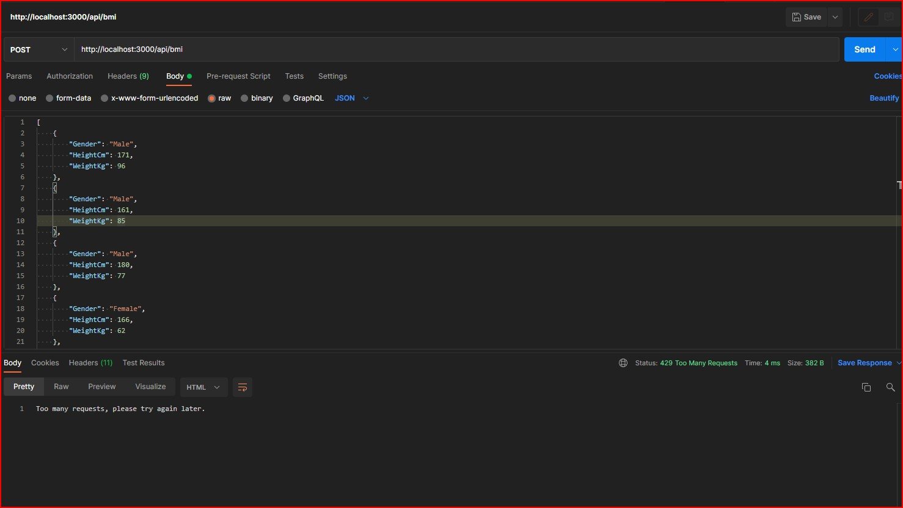
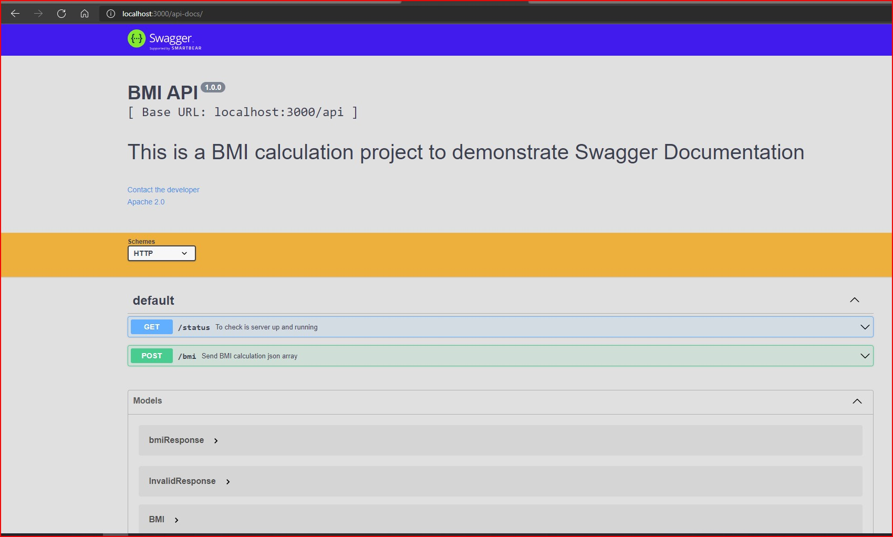

# Node API Proxy Server

Server used for hiding API keys, rate limiting and caching. This uses the [OpenWeather API](https://openweathermap.org/api) but you can easily change it to whatever public API you are using

## Usage

### Install dependencies

```bash
npm install
```

### Run on http://localhost:3000

```bash
npm run dev
```

# Normal Installation

1. Install node.js and git
2. Add them to path if not already in path.
3. Install typescript globally with `npm install`
4. Run npm install to get all the dependencies installed
5. cd to the project directory
6. Run dev `npm run-script start-dev`
7. Run prod `npm run-script start-prod`

# Getting Started

Minimal Mistakes takes advantage of Sass and data files to make customizing easier. These features require Jekyll 2.x and will not work with older versions of Jekyll.

To learn how to install and use this theme check out the [Setup Guide](http://mmistakes.github.io/minimal-mistakes/theme-setup/) for more information.

# Formatting

The project comes with prettier configs and extensions built in.

You can format the project manually by running the command `npm run format` and prettier will format the project for you.

You may want to install an extension for your IDE though. More details on the same is available at https://prettier.io

## Linting

You can customize rules if needed using the .eslintrc file placed in the root directory. If you are using VSCode, you can have the ESLint extension installed. While linting is run everytime you build/start the server, you can manually run it by `npm run lint`

# Generate API Documentation (OpenAPI/Swagger)

You can generate documentation site by providing details regarding all the endpoints in the `apidoc.yaml` file in the root and once done, you can start the server and your documentation will get exposed in `/api-docs` URL. You can use tools like [OpenAPI GUI](https://mermade.github.io/openapi-gui/) to help generate the YAML file for you.

# Editorconfig

A ```.editorconfig``` file has been added to the project to enable consistency in development across different IDEs used by different developers. Visit http://editorconfig.org for more information. You might have to install plugins in your editor to get this to work.


# Environmental Variables

You can set up the environmental variables in the .env file and that will get used in files like docker-compose, Dockerfile, etc. In addition to this, you can set up the rest of the environmental configurations in `.env` where yourenv can be anything and the respective configs will get loaded depending on env you set.

# Development vs Production Environment

The development and production environments has some notable differences in their implementation. Everything is handled automatically when run with the right compose file.

1. Use of `nodemon` in development and directly running with `node` in production
2. `Single Stage Build` for Docker image in development and `Multi Stage Build` for Docker image in production
3. `devDependencies installed` in development but `devDependencies ignored` in production

#  Compatibility

Since this project uses all the latest features of the node ecosystem, it requires Node >= v10.0.0


# Added below packages.

1.  "apicache": "^1.6.3"
2.  "body-parser": "^1.19.0"
3.  "cors": "^2.8.5"
4.  "dotenv": "^10.0.0"
5.  "express": "^4.17.1"
6.  "express-rate-limit": "^5.5.0"
7.  "needle": "^3.0.0"
8.  "swagger-jsdoc": "^6.1.0"
9.  "swagger-ui-express": "^4.1.6"
10. "winston": "^3.3.3"
11. "winston-daily-rotate-file": "^4.5.5"

# devDependencies

1. "chai": "^4.3.4"
2. "eslint": "^8.1.0"
3. "mocha": "^9.1.3"
4. "nodemon": "^2.0.14"

# Added express-rate-limit

To limit number hit per min ,current config is 5 request per 10 min limit

# Access swagger API Documentation

http://localhost:3001/api-docs/

# If Request rate limit exceeded



# Swagger API doc



# Sample Json

```[
    {
        "Gender": "Male",
        "HeightCm": 171,
        "WeightKg": 96
    },
    {
        "Gender": "Male",
        "HeightCm": 161,
        "WeightKg": 85
    },
    {
        "Gender": "Male",
        "HeightCm": 180,
        "WeightKg": 77
    },
    {
        "Gender": "Female",
        "HeightCm": 166,
        "WeightKg": 62
    },
    {
        "Gender": "Female",
        "HeightCm": 150,
        "WeightKg": 70
    },
    {
        "Gender": "Female",
        "HeightCm": 167,
        "WeightKg": 82
    }
]
```

# Expected output:

```{
    "BMIResult": [
        {
            "Gender": "Male",
            "HeightCm": 171,
            "WeightKg": 96,
            "category": "Very severely obese",
            "health_risk": "Very high risk",
            "bmi": "56.14"
        },
        {
            "Gender": "Male",
            "HeightCm": 161,
            "WeightKg": 85,
            "category": "Very severely obese",
            "health_risk": "Very high risk",
            "bmi": "52.80"
        },
        {
            "Gender": "Male",
            "HeightCm": 180,
            "WeightKg": 77,
            "category": "Very severely obese",
            "health_risk": "Very high risk",
            "bmi": "42.78"
        },
        {
            "Gender": "Female",
            "HeightCm": 166,
            "WeightKg": 62,
            "category": "Severely obese",
            "health_risk": "High risk",
            "bmi": "37.35"
        },
        {
            "Gender": "Female",
            "HeightCm": 150,
            "WeightKg": 70,
            "category": "Very severely obese",
            "health_risk": "Very high risk",
            "bmi": "46.67"
        },
        {
            "Gender": "Female",
            "HeightCm": 167,
            "WeightKg": 82,
            "category": "Very severely obese",
            "health_risk": "Very high risk",
            "bmi": "49.10"
        }
    ],
    "categoryAnalysis": {
        "Very severely obese": 5,
        "Severely obese": 1
    },
    "healthRiskAnalysis": {
        "Very high risk": 5,
        "High risk": 1
    }
}
```
